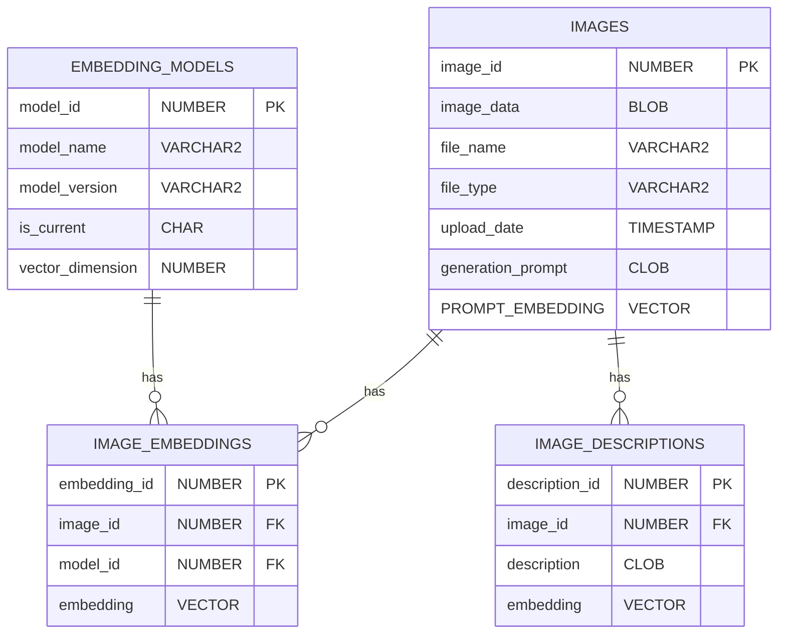

本記事は日本オラクルが運営する __Oracle AI Jam Session #17__ で発表予定の内容です。

https://oracle-code-tokyo-dev.connpass.com/event/327094/

## はじめに
こんなことはないでしょうか？
- 撮り溜めた写真や画像生成AIで作った画像が沢山溜まってしまって見たい・活用したい画像が見つけられない！
- 事業で蓄積している画像データが沢山あるが分類整理などに手間をかけられず有効活用できていない！

そんなときに役に立つマルチモーダル画像検索アプリの作り方をご紹介します！

アルバムや画像データベースの中から「寝ている三毛猫」や「地球と天の川が写っている写真」のような言葉を使って画像を検索したり、手元の画像とよく似た画像を見つけ出すようなマルチモーダル画像検索アプリケーションの作り方と裏側の技術をざっくりご説明！

また、画像生成AIで生成した際のプロンプトを検索したり、あらかじめキャプション（画像の説明）を生成・登録したり画像に写っているテキストをOCR的に抽出・登録しておいてこれらを元に画像を検索する方法もあわせてご紹介しています。これは、マルチモーダル RAG にも応用可能！

作ってみたコードは GitHub で公開しています。

https://github.com/kutsushitaneko/multimodal-image_search

## アプリケーションの紹介
### 自然言語で画像を検索
入力した検索テキストと __類似した特徴__ を持つ画像を検索


### 画像で画像を検索
アップロードした画像と __類似した特徴__ を持つ画像を検索


### キャプションを検索して、該当画像を表示
- 事前に画像のキャプション（説明）を __AIで自動生成__ してデータベースへ登録
- 入力した検索テキストと __類似した特徴__ を持つキャプションを検索
- ヒットしたキャプションの画像を表示


### OCRテキストを検索して、該当画像を表示
- 事前に画像からテキストを __AIで自動抽出__ してデータベースへ登録
- 入力した検索テキストと __類似した特徴__ を持つ抽出テキストを検索
- ヒットした抽出テキストの画像を表示


### 画像生成プロンプトを検索して、該当画像を表示
- 事前に画像生成プロンプトをデータベースへ登録
- 全文検索を使って検索テキスト、正確に一致するプロンプトを検索
- ヒットした画像を表示


（生成時の seed 値 "738268214" で検索した例）

## アプリケーションのアーキテクチャ


## 使用する主要な要素技術
- __ベクトル検索__
- 全文検索
- __マルチモーダル埋め込みモデル（画像言語特徴抽出モデル）__
- __マルチモーダルLLM（ビジョン・ランゲージ・モデル）__
- テキスト埋め込みモデル
- リランカー

※以下では、太字の要素技術について解説しています
### ベクトル検索
- 画像や文書などの特徴を数値ベクトルの形で表現したものを特徴ベクトルと呼びます
- 事物には多様な特徴があり特徴ベクトルの次元数は数百から数千に及びます
- 似た事物は、似た特徴を持ち、この多次元のベクトル空間の中で近くに位置します
- 似たものを見つけるには、特徴ベクトル間の距離を計算して、最も近くに位置する特徴ベクトルを見つければよいこととなります

例えば、この下図のイメージでは、猫の画像の特徴ベクトルをクエリーとして、それに一番近い特徴ベクトルを検索することで、類似した画像を見つけています。
一方で、犬の画像や自動車の画像は、猫とは異なる特徴を持っているため猫の特徴を持ったクエリーベクトルとは、ベクトル空間内で遠くに位置しています。
（高次元空間では「次元の呪い」と呼ばれる特有の難しさがあり、実際の応用ではベクトル間の角度に基づくコサイン類似度やコサイン距離（1 - コサイン類似度）が用いられることが多い。）


このようなベクトル検索を可能にするデータベースをベクトルデータベースと呼びます。
今回の作例では、Oracle Database のベクトルデータベース機能である AI Vector Search を使用します。

ベクトルデータベースに格納する特徴ベクトルの生成には、多くの場合、深層学習に基づいた埋め込みモデルが使われます。埋め込みモデルが生成した特徴ベクトルは「埋め込み」や「エンベディング」とも呼ばれます。

__特徴__ は深層学習のアルゴリズムにより決定されるため人間が認識する事物の特徴や言葉の意味とは厳密には一致しません。

### マルチモーダル埋め込みモデル（画像言語特徴抽出モデル）
マルチモーダル埋め込みモデルは、異なる種類のデータ（例えば、テキスト、画像、動画、音声など）を共通の埋め込み空間（ベクトル空間）にマッピングする技術です。これにより、異なるモーダリティのデータを統一的に扱うことが可能になります。マルチモーダル基盤モデルの一種です。


#### CLIP（Contrastive Language-Image Pre-training）
代表的なマルチモーダル埋め込みモデルには、CLIPがあります。2021年にOpenAIによって公開されました（OpenAIの[ブログ](https://openai.com/index/clip/)、[実装](https://github.com/OpenAI/CLIP)）。CLIPは、インターネット等から収集された大規模な画像とテキストのペア（4億ペア）を用いて学習しています。学習は以下のように行われます。


[Learning Transferable Visual Models From Natural Language Supervision](https://arxiv.org/abs/2103.00020) 
Figure 1. Summary of our approach.

- 収集したデータセットからN個の画像-テキストのペアをピックアップします（オリジナルの CLIP では、32768 のミニバッチ毎）
- N個の画像とN個のテキストそれぞれの特徴ベクトルを計算します（画像とテキストは同一の埋め込み空間にマッピングされます）
- N個の画像の特徴ベクトルとN個のテキストの特徴ベクトルのすべての組み合わせの類似度を計算します（N^2組）
- 画像とテキストの組み合わせが関連のあるペアである場合（上図の対角の水色のN組）に類似度が高くなり、無関係な組み合わせである場合（N^2 - N組）には類似度が低くなるように学習します

テキストの特徴ベクトルを生成するテキストエンコーダーには transformer を、画像の特徴ベクトルを生成する画像エンコーダーには、ResNet（CNNをベースにしたモデル）かVision Transformer (ViT)を利用することができます。

このような学習により、テキストと画像を同一の埋め込み空間上にマッピングすることができます。そして、埋め込み空間上のテキストベクトルと画像ベクトルの位置は、テキストと画像が意味的に近いものは近く、意味的に異なるものは遠くへ位置することとなります。

このことから、テキストの意味に近い画像を検索する際には、テキストベクトルの近くにある画像ベクトルを見つければ良いこととなります。この近いベクトルを見つけるのはベクトルデータベースの役割となります。

なお、マルチモーダル埋め込みモデル（画像言語特徴抽出モデル）は、画像検索だけでなく、画像の分類にも利用できます（こちらが元々の使い方でもあります）。

画像検索とは検索の方向を逆にして、問い合わせとなる画像の画像ベクトルの近くにあるテキストベクトルを見つけることで、そのテキストが表すカテゴリ（分類クラス）への分類が実現できます。

従来の画像分類モデルは分類可能なカテゴリー（分類クラス）が学習に用いられたラベルだけに限定されていましたが、CLIPは大規模な画像・テキストのペアを学習していることからFine-tuningをすることなく任意の分類カテゴリーに対する分類が可能です。これはゼロショット画像分類と呼ばれています。

__CLIPを利用した画像分類例__


__CLIPを利用した画像分類アプリケーション作成の記事__

https://qiita.com/yuji-arakawa/items/042937eaf16fa00cf491

さらに、CLIP の応用は、画像検索や分類だけに限定されるものではありません。画像生成AIとして有名な Open AI の DALL-E2、Stability AI の Stable Diffusion や Black Forest Labs の FLUX.1 等のプロンプトの言語理解と画像生成のガイドの機能を担うなど幅広い分野に応用されています。

:::note
「猫」というテキストプロンプトで「猫の画像」を生成する仕組み
- ポイント：__猫のテキストベクトル　≒　猫の画像ベクトル__
- 手順の概要：
    - 逆拡散過程の途中の生成画像と猫のテキストベクトルの類似度（内積）を計算する。これは、生成された画像と猫画像の類似度を計算したことになる（猫のテキストベクトル　≒　猫の画像ベクトルなので）
    - この類似度が高くなるように生成画像を微調整する
    - 微調整された画像を元に逆拡散過程、類似度計算、微調整を繰り返す
    - 生成画像は猫画像へ近づいていく
:::

##### 画像生成の記事
Stable Diffusion 3 Medium を使った画像生成アプリケーション

https://qiita.com/yuji-arakawa/items/1a8cfeff8f81ba808389

FLUX.1 を使った画像生成アプリケーションや ComfyUI の使い方

https://qiita.com/yuji-arakawa/items/fd4fd0c026ecfa664d97

#### Japanese Stable CLIP

オリジナルの CLIP は、英語のキャプションデータと画像で学習したモデルであったため日本語テキストでの検索には対応していませんでした。画像生成AI の Stable Diffusion で有名な Stability AI 社は、キャプションデータを日本語に翻訳したデータセットで学習させることにより日本語に対応した CLIP モデルを開発し、Japanese Stable CLIP として発表しました。

本作例では、マルチモーダル埋め込みモデル（画像言語特徴抽出モデル）として、Japanese Stable CLIP を使用しています。

https://ja.stability.ai/blog/japanese-stable-clip

#### その他のマルチモーダル埋め込みモデル（画像言語特徴抽出モデル）
日本語に対応した代表的なマルチモーダル埋め込みモデル（画像言語特徴抽出モデル）には以下のようなものがあります。

|時期|開発者|モデル名|モデル|記事 <br> プレスリリース|
|---|---|---|---|---|
|2023年11月|stability ai|Japanese Stable CLIP|https://huggingface.co/stabilityai/japanese-stable-clip-vit-l-16|https://ja.stability.ai/blog/japanese-stable-clip|
|2024年1月|リクルート|japanese-clip-vit-b-32-roberta-base|https://huggingface.co/recruit-jp/japanese-clip-vit-b-32-roberta-base|https://blog.recruit.co.jp/data/articles/japanese-clip/|
|2024年5月|LINE|clip-japanese-base|https://huggingface.co/line-corporation/clip-japanese-base|https://techblog.lycorp.co.jp/ja/20240514b|

今後、このリストは次の記事で更新を継続しますので、こちらもご参照ください。

https://qiita.com/yuji-arakawa/items/1135f6d71acdec157db3

### マルチモーダルLLM（ラージ・ビジョン・ランゲージ・モデル）
マルチモーダルLLMの略称は、__MLLM__ もしくは、MMLLM。ラージ・ビジョン・ランゲージ・モデルの略称は、LVLM。

マルチモーダル基盤モデルの一種で、以下のようなタスクをモデル単体で実現できるもの。
- Image Captiong/Multi-modal Understanding/Vision Understanding と呼ばれる画像や動画の説明文を生成するタスク
- 画像に写っているテキストを抽出する OCR
- Visual Question Answering (VQA) と呼ばれる画像や動画に対するテキストによる質問（問い合わせ）にテキストで答えるタスク

#### キャプション生成例
Qwen2-VL 7Bモデル（70億パラメータ）による生成例
<table>
<tr>
<td>
画像
</td>
<td>

</tr>
<tr>
<td>
プロンプト
</td>
<td>
画像を詳細に説明してください。 また、オブジェクト間の位置関係も説明してください。
</td>
</tr>
<tr>
<td>
生成された説明文
</td>
<td>
この画像には、魔法使いのような衣装を着た女の子と2匹の白い猫が描かれています。女の子はピンクのドレスを着ており、金色の靴を履いています。彼女の頭には金色の冠があり、肩からは紫色の翼が見えます。彼女は右手で魔法の杖を持ち、杖先には光が放射されています。

左側の猫は正面を向いており、右側の猫は女の子の足元に座っています。背景には青い色調の光が差し込み、光の下に大きな石柱が見えます。全体的に幻想的な雰囲気があります。

</td>
</tr>
</table>

#### 図の説明例
Qwen2-VL 7Bモデル（70億パラメータ）による生成例
<table>
<tr>
<td>
画像
</td>
<td>

</tr>
<tr>
<td>
プロンプト
</td>
<td>
画像をできるだけ詳細に説明してください。
</td>
</tr>
<tr>
<td>
生成された説明文
</td>
<td>
この画像は、RAG（Retrieval-Augmented Generation）のプロセスを説明している図です。RAGは、検索と生成を組み合わせたテクノロジーで、特に行政やエンタープライズのデータ利活用に用いられます。

1. 質問：ユーザーが質問を提出します。
2. クエリ：アプリケーションが質問を解析し、検索用のクエリを作成します。
3. 検索結果：クエリがデータベースに送られ、関連するデータが検索されます。
4. 回答生成指示：大規模言語モデルが検索結果を分析し、回答の指示を生成します。
5. 回答：アプリケーションが指示に基づいて回答を生成します。
6. 回答：ユーザーが回答を受け取ります。

データソースには、非構造化データと構造化データがあります。非構造化データには、住民情報、防災情報、ゴミ収集管理、文書管理、Workday、議会情報、税務情報、福祉情報、公共施設予約などが含まれます。構造化データには、JSON、リレーショナル、ベクトル、グラフ、テキストサーチ、地理空間データなどが含まれます。

このプロセスは、データの取り込み、同期、インデックス化を含みます。データの取り込みは、さまざまなデータソースから行われ、同期はデータの更新を管理し、インデックス化はデータの検索を効率化します。

</td>
</tr>
</table>

#### マルチモーダルLLMアーキテクチャ概要


マルチモーダルLLMは、画像埋め込みモデルと大規模言語モデルのキメラとも言える構造をしています。
- Vision Encoder：CLIPなどの画像埋め込みモデルを使用して、画像から視覚的特徴を抽出した画像ベクトルを生成します
- Projection：画像ベクトルを大規模言語モデルの（テキストの）埋め込み空間へ __マッピング__ します
- 大規模言語モデル：テキストと視覚情報を統合して回答を生成します

#### Qwen2-VL
Qwen2-VLは、Alibaba Cloudが開発した最新のビジョン・ランゲージ・モデルです。このモデルは、画像やビデオの理解能力に優れており、MMMU-Proベンチマークでは、商用のクローズドモデル（GPT-4o、Claude 3.5 Sonnet、Gemini 1.5 Pro）に匹敵する結果が出ています。また、20分以上の動画を高品質で理解することができます。さらに、複雑なオブジェクトの関係性や多言語のテキストを認識する能力も持ち合わせています


（["MMMU-Pro: A More Robust Multi-discipline Multimodal Understanding Benchmark"](https://arxiv.org/abs/2409.02813)の "Figure 1:Overview of different multimodal LLMs’ performance on MMMU-Pro and MMMU (Val)." から引用）

__Qwen2-VL__ の検証記事

https://qiita.com/yuji-arakawa/items/122fa187309de013ec62

#### その他のマルチモーダルLLM
その他のマルチモーダルLLMには以下のようなものがあります。

|時期|開発者|モデル名|モデル|記事 <br> プレスリリース|
|---|---|---|---|---|
|2023年11月|stability ai|Japanese Stable VLM|https://huggingface.co/stabilityai/japanese-stable-vlm|https://ja.stability.ai/blog/japanese-stable-vlm|
|2024年1月|Haotian Liu, Chunyuan Li, Yuheng Li, Bo Li, Yuanhan Zhang, Sheng Shen, Yong Jae Lee|LLaVA-NeXT|https://github.com/haotian-liu/LLaVA/blob/main/docs/MODEL_ZOO.md|https://github.com/LLaVA-VL/LLaVA-NeXT|
|2024年5月|openbmb|MiniCPM-Llama3-V-2_5|https://huggingface.co/openbmb/MiniCPM-Llama3-V-2_5|https://github.com/OpenBMB/MiniCPM-V <br> https://unfoldai.com/minicpm-llama3-v-2-5-review/|
|2024年6月|CyberAgent|llava-calm2-siglip|https://huggingface.co/cyberagent/llava-calm2-siglip|https://www.cyberagent.co.jp/news/detail/id=30344|
|2024年7月|InternLM|InternLM-XComposer-2.5|https://github.com/InternLM/InternLM-XComposer|https://github.com/InternLM/InternLM-XComposer <br> https://www.youtube.com/watch?v=8tYpiQNOJww|
|2024年8月|Sakana AI|Llama-3-EvoVLM-JP-v2|https://huggingface.co/SakanaAI/Llama-3-EvoVLM-JP-v2|https://sakana.ai/evovlm-jp/|
|2024年8月|Axcxept co., ltd.|Llama-3-EZO-VLM-1|https://huggingface.co/HODACHI/Llama-3-EZO-VLM-1|https://prtimes.jp/main/html/rd/p/000000006.000129878.html|
|2024年8月|ByteDance等|LLaVA-OneVision|https://huggingface.co/collections/lmms-lab/llava-onevision-66a259c3526e15166d6bba37|https://llava-vl.github.io/blog/2024-08-05-llava-onevision/<BR>https://arxiv.org/abs/2408.03326<BR>https://huggingface.co/docs/transformers/main/en/model_doc/llava_onevision|
|2024年8月|Alibaba Cloud|Qwen2-VL（※）|https://huggingface.co/collections/Qwen/qwen2-vl-66cee7455501d7126940800d|https://qwenlm.github.io/blog/qwen2-vl/<BR>https://github.com/QwenLM/Qwen2-VL|

今後、このリストは次の記事で更新を継続しますので、こちらもご参照ください。

https://qiita.com/yuji-arakawa/items/1135f6d71acdec157db3

## 使用するサービス・モデル・フレームワーク


## サンプルコードの説明
### マルチモーダルなベクトルの生成
自然言語テキストと画像の間で検索を行うためには、テキストと画像の双方のマルチモーダルなベクトルを生成する必要があります。

このベクトル生成には、 __Japanese Stable CLIP モデル__ と、モデルの操作には、__Hugging Face Transformers__ （自然言語処理ライブラリ）を使用しています。

#### モデルのロード

次の`register_images.py` のコードは、Japanese Stable CLIP モデルをロードしています。他のコードでも、Japanese Stable CLIP モデルのロードは同様です。

```python:register_images.py
device = "cuda" if torch.cuda.is_available() else "cpu"
model_path = "stabilityai/japanese-stable-clip-vit-l-16"
model = AutoModel.from_pretrained(model_path, trust_remote_code=True).eval().to(device)
processor = AutoImageProcessor.from_pretrained(model_path)
```
- `device = "cuda" if torch.cuda.is_available() else "cpu"`で、サーバーが CUDA環境、つまり、CUDA対応のGPUを搭載していて、GPU対応版の PyTorch がインストールされている環境であれば、モデルのロード先をGPUに、それ以外の場合は、CPUに設定しています
- `model_path = "stabilityai/japanese-stable-clip-vit-l-16"`は、Hugging Face Hub における Japanese Stable CLIP モデルのモデルIDを設定しています
- `model = AutoModel.from_pretrained`は、Hugging Face Hub からモデルをロードしてインスタンス化します。インスタンス model は後に、__テキストや画像をベクトル化__ するときに使用します
- `trust_remote_code=True` は、カスタムモデルなど Hugging Face 自身がアップロードしているモデルやコード以外のものを信頼して実行することを許可します
- `eval()`はモデルを評価モードに設定します。評価モードとは、学習時ではなく __推論時に使用するモード__ です。学習時にのみ必要となる機能が無効となります
- `to(device)`で、モデルを指定されたデバイス（GPUまたはCPU）に移動します
- `processor = AutoImageProcessor.from_pretrained(model_path)`で、モデルに対応する画像プロセッサをロードしてインスタンス化します。画像プロセッサは入力画像をモデルが期待する形式に __前処理__ するために使用されます。画像のリサイズやクロップ、ピクセルからテンソルへの変換などを行います

#### マルチモーダルな画像ベクトルの生成
画像データから画像の特徴を表すベクトルを生成します。画像データをデータベースへ登録する処理（register_images.py）と画像をクエリーとして画像を検索する処理（MultiModalImageSearch.py）で必要となります。
画像をデータベースへ登録する `register_images.py` では、images ディレクトリにある画像ファイルを読み取って、それを __Japanese Stable CLIP モデル__ を使って画像ベクトルへ変換、データベースへ登録しています。

```python:register_images.py
def compute_image_embeddings(image):
    image = processor(images=image, return_tensors="pt").to(device)
    with torch.no_grad():
        image_features = model.get_image_features(**image)
    image_features = image_features / image_features.norm(p=2, dim=-1, keepdim=True)
    return image_features.cpu().detach().numpy()[0].tolist()
```
このコードは画像ベクトルを計算する関数 `compute_image_embeddings` です。

1. `image = processor(images=image, return_tensors="pt").to(device)`
   - 入力画像をモデルが受け入れ可能な形式に前処理します
   - `return_tensors="pt"` はPyTorchのテンソルを返すように指定しています
   - `.to(device)` で処理をGPUまたはCPUに移動します

2. `with torch.no_grad():`
   - 学習時にだけ必要な勾配計算を無効にし、メモリ使用量を減らし、計算を高速化します

3. `image_features = model.get_image_features(**image)`
   - `model = AutoModel.from_pretrained`でインスタンス化したモデルを使用して画像の特徴ベクトルを抽出します

4. `image_features = image_features / image_features.norm(p=2, dim=-1, keepdim=True)`
   - 画像の特徴ベクトルをL2正規化します。これにより、ベクトルの長さが1になります。`.norm(p=2)`は、L2ノルムを計算します。L2ノルムは多次元におけるユークリッド距離と解釈できます。ユークリッド距離とは我々が日常経験するユークリッド幾何学が成り立つ空間における距離です
   - ２つのベクトルの比較をする際に、コサイン類似度の計算を容易にします。つまり、コサインの計算を内積だけで実行できるようになるため計算量を減らすことができます（コサイン計算の分母の計算と分母による割り算が不要になる）
   - 異なる画像間の比較を公平にします。画像ベクトルの大きさが異なっていて、画像ベクトル間の内積を類似度の指標としてしまうと大きなベクトルが関わる画像程、類似度（内積）が大きくなってしまうため公平な比較が困難となりますが、正規化によりこれを回避できます

この処理により、入力画像の正規化された画像ベクトルが得られ、後続の処理や比較に使用できます。

#### マルチモーダルなテキストベクトルの生成
検索テキストからテキストの特徴を表すベクトルを生成します。テキストをクエリーとして画像を検索する処理（MultiModalImageSearch.py）で必要となります。
```python:MultiModalImageSearch.py
def compute_text_embeddings(text):
    if isinstance(text, str):
        text = [text]
    text = tokenize(texts=text)
    text_features = model.get_text_features(**text.to(device))
    text_features = text_features / text_features.norm(p=2, dim=-1, keepdim=True)
    del text
    return text_features.cpu().detach()
```
1. `if isinstance(text, str): text = [text]`
    - 入力テキストの前処理を行います
    - 入力 `text` が単一の文字列の場合、単一要素のリストに変換し、複数の文字列を要素に持つリストの場合はそのまま、後続のステップへ渡します。これにより、複数のテキストを一度に処理できるようになります。今回の作例では不要ですが、事前に複数のテキストのベクトルを生成しておく必要のある分類タスクなどで有用です

2. `tokenize`
   - テキストをモデルが理解できる形式（トークン）に変換します

3. `model.get_text_features()`
    -トークン化されたテキストからテキスト特徴量（ベクトル）を抽出します
   - `**text.to(device)` は、テキストデータを`device`で指定されたGPUなどの適切なデバイスに移動させます

4. `text_features = text_features / text_features.norm(p=2, dim=-1, keepdim=True)`
   - 抽出された特徴量ベクトルを L2 ノルムで正規化します。これにより、ベクトルの長さが1になり、異なるテキスト間の比較が容易になります（マルチモーダルな画像ベクトルの生成における正規化の説明参照）

5. `del text`
   - 不要になったテキストデータを削除し、メモリを解放します。

この関数は、テキストデータを数値ベクトルに変換することで、テキストの意味的な類似性を計算したり、検索や分類などのタスクに利用したりすることができます。

### クロスモーダル検索
#### 自然言語ベクトル検索（テキスト⇒画像）
```sql:MultiModalImageSearch.py
SELECT i.image_id, i.file_name, i.generation_prompt,
        id.description as combined_description,
        cie.embedding <#> :query_embedding as vector_distance,
        'vector' as method
    FROM CURRENT_IMAGE_EMBEDDINGS cie
    JOIN IMAGES i ON cie.image_id = i.image_id
    LEFT JOIN IMAGE_DESCRIPTIONS id ON i.image_id = id.image_id
    ORDER BY vector_distance
    FETCH FIRST :limit ROWS ONLY
```

1. `cie.embedding <#> :query_embedding as vector_distance` 
    - Oracle Database 23ai AI Vector Search のベクトル検索
    - <#> は、負の内積で、DOT PRODUCT（内積）の 符号を反転したもの
    - CURRENT_IMAGE_EMBEDDINGS ビューの embedding 列（データベース上の画像ベクトル）と query_embedding （検索テキストのベクトル）の内積 x (-1)を計算して、vector_distance と名付けている
2. `ORDER BY vector_distance`
    - vector_distanceを昇順に並べ替えて類似度が高い順に並べている（ベクトル間の内積 x (-1)を昇順なので、内積の降順となり類似度が高い順となる）

:::note
類似度と距離
ベクトルとベクトルの __類似度と表現した場合は、値が大きい程似ている（近い）__
ベクトルとベクトルの __距離と表現した場合は、値が小さい程似ている（近い）__

内積そのものは、大きい程2つのベクトルが似ていることを意味しますが、マイナス１倍することで小さい程似ている（近い）という距離の概念で理解できます
:::

#### 自然言語ベクトル検索（画像⇒画像）
これはクロスモーダルではありませんが、画像対画像の検索も自然言語ベクトル検索（テキスト⇒画像）のSQLの query_embedding にクエリーとなる画像のベクトルをセットするだけで実行できます。

### キャプション（説明、OCR）の生成
#### モデルのロード
本作例では、画像のキャプションの生成には、Qwen2-VL の 7B（70億）パラメータモデルを使用します。Qwen2-VL には、より高性能な 72B（720億）パラメータモデルと、より軽量な 2B（20億）パラメータモデルがあります。
```python:generate_caption.py
model_id = "Qwen/Qwen2-VL-7B-Instruct"
model = Qwen2VLForConditionalGeneration.from_pretrained(
    model_id, torch_dtype="auto", device_map="auto"
)
processor = AutoProcessor.from_pretrained("Qwen/Qwen2-VL-7B-Instruct",
    min_pixels=256 * 28 * 28,
    max_pixels=1280 * 28 * 28
)
```

1. モデルの指定
   - `model_id = "Qwen/Qwen2-VL-7B-Instruct"`で、Hugging Face Hub の モデルID `Qwen/Qwen2-VL-7B-Instruct`を指定しています（[Qwen/Qwen2-VL-7B-Instruct](https://huggingface.co/Qwen/Qwen2-VL-7B-Instruct)）
   - Qwen2-VLの 7Bパラメータモデルです

2. モデルの初期化
   - Transformers の `Qwen2VLForConditionalGeneration`クラスを使用してモデルをロードしてインスタンス化しています（[Qwen2VLForConditionalGeneration リファレンス](https://huggingface.co/docs/transformers/main/en/model_doc/qwen2_vl#transformers.Qwen2VLForConditionalGeneration)）
   - `torch_dtype="auto"`は、利用可能な最適な精度を自動的に選択します。
   - `device_map="auto"`は、利用可能なGPUやCPUに自動的にモデルを配置します。

3. プロセッサの初期化
   - Transformers の `AutoProcessor`を使用してプロセッサ（Qwen2VLImageProcessor）をロードしてインスタンス化します。（[Qwen2VLImageProcessor リファレンス](https://huggingface.co/docs/transformers/main/en/model_doc/qwen2_vl#transformers.Qwen2VLImageProcessor)）
4. 画像サイズの制限
   - `min_pixels=256 * 28 * 28` はリサイズする最小画像サイズを設定しています（約20万ピクセル）
   - `max_pixels=1280 * 28 * 28` はリサイズする最大画像サイズを設定しています（約100万ピクセル）
   - __これらの値を大きくすることでより精度を上げることができますがメモリ使用量が増えます__

#### キャプション生成のプロンプトと画像の前処理
Qwen2-VL モデルでキャプションを生成するためのプロンプトと対象画像の準備をします。

```python:generate_caption.py
def process_image(image_path):
    messages = [
        {
            "role": "user",
            "content": [
                {
                    "type": "image",
                    "image": Image.open(image_path),
                },
                {"type": "text", "text": "画像を詳細に説明してください。 また、オブジェクト間の位置関係も説明してください。画像がテキストを主体としたものである場合は、テキストを抽出してください。"},
            ],
        }
    ]

    # プロンプトの準備
    text = processor.apply_chat_template(
        messages, tokenize=False, add_generation_prompt=True
    )

    # イメージの準備
    image_inputs, video_inputs = process_vision_info(messages)

    # モデル入力の準備
    inputs = processor(
        text=[text],
        images=image_inputs,
        videos=video_inputs,
        padding=True,
        return_tensors="pt",
    )
    inputs = inputs.to("cuda")
```

1. プロンプトに指定する項目を準備します
    - `messages`リストを作成します
        - ユーザーの役割（"role": "user"）
        - コンテンツ（"content"）：
        - 画像ファイル（PILのImage.openを使用して開きます）
        - テキストプロンプト（画像の詳細な説明を要求）

2. チャット形式のプロンプトを準備します
    - `processor.apply_chat_template`メソッドを使用して、`messages`リストにチャットテンプレートを適用します
        - `tokenize=False`：トークン化せずにテキストとして返します
        - `add_generation_prompt=True`：Qwen2-VLに適したプロンプトを追加します

3.  messages から画像と動画の入力を準備します
    - `process_vision_info(messages)` 関数でメッセージ内の画像や動画データを適切な形式に変換します
        - `process_vision_info` は、`qwen_vl_utils` からインポートされた関数です
        - Qwen2-VL には、動画のキャプションを生成する能力もあります。今回は使っていません
4. プロセッサインスタンス `processor` を使用して、テキスト、画像、動画の入力を前処理します

#### キャプションの生成
```python:generate_caption.py
    generated_ids = model.generate(**inputs, max_new_tokens=1000, repetition_penalty=1.1)
    generated_ids_trimmed = [
        out_ids[len(in_ids) :] for in_ids, out_ids in zip(inputs.input_ids, generated_ids)
    ]
    output_text = processor.batch_decode(
        generated_ids_trimmed, skip_special_tokens=True, clean_up_tokenization_spaces=False
    )
```
1. キャプションの生成
`generate()` メソッドでキャプションを生成します。トークンIDのリストが返されます。これには、入力プロンプトも含まれています
    - `max_new_tokens=1000`: 生成する最大トークン数を1000に設定しています
    - `repetition_penalty=1.1`: 繰り返しを抑制するためのペナルティを設定しています。これを指定しないと __同じ言葉が永遠に繰り返される__ ことがあります

2. 生成されたキャプション・トークンの抽出
model の `generated_ids_trimmed` は、生成されたテキストのトークン群から入力テキスト（プロンプト）のトークン群を除去したリストです。これは、モデルの出力がプロンプトも含んでいるため、新しく生成されたキャプション部分のみを取得するためです

3. 生成されたトークンをテキストにデコード
processor の `batch_decode()` メソッドを使用します
   - `skip_special_tokens=True`: 特殊トークンをスキップします
   - `clean_up_tokenization_spaces=False`: トークン化によって生じた余分なスペースを削除しません

最終的に、`output_text` に生成されたキャプションが格納されます。

### キャプション（説明、OCR）のテキストベクトルの生成
検索テキストをクエリーとして、類似したキャプション・テキストをベクトル検索するためには、テキストベクトル（埋め込み、エンベディング）を生成し、データベースへ格納しておく必要があります。

テキストベクトルの生成には、OCI Generative AI サービスの Cohere Embed Multi Lingual V3 を使用します。
#### OCI Generative AIサービスの設定

```python:register_caption_embeddings.py
CONFIG_PROFILE = "DEFAULT"
config = oci.config.from_file('~/.oci/config', CONFIG_PROFILE)
compartment_id = os.getenv("OCI_COMPARTMENT_ID") 
model_id = "cohere.embed-multilingual-v3.0"
generative_ai_inference_client = oci.generative_ai_inference.GenerativeAiInferenceClient(
    config=config,
    retry_strategy=oci.retry.NoneRetryStrategy(),
    timeout=(10,240)
    )
```
1. `CONFIG_PROFILE = "DEFAULT"`: OCIの設定プロファイルを指定しています。デフォルトのプロファイルを使用しています

2. `config = oci.config.from_file('~/.oci/config', CONFIG_PROFILE)`: OCIの設定ファイルから設定を読み込んでいます

3. `compartment_id = os.getenv("OCI_COMPARTMENT_ID")`: 環境変数からOCIのコンパートメントIDを取得しています。本作例では、あらかじめ .env ファイルに設定しておきます

4. `model_id = "cohere.embed-multilingual-v3.0"`: 使用するモデルのIDを指定しています

5. `generative_ai_inference_client = ...`: Generative AI サービスの推論クライアントを初期化しています。以下のパラメータを設定しています：
   - `config`: 先ほど読み込んだOCI設定
   - `retry_strategy`: リトライ戦略を無効化
   - `timeout`: タイムアウトを10秒（接続）と240秒（読み取り）に設定

#### キャプションのテキストベクトルの生成
OCI Generative AI サービスの Cohere Embed Multi Lingual V3 を使用して、テキストのベクトルを生成します。
```python:register_caption_embeddings.py
def generate_embeddings(batch):
    embed_text_detail = oci.generative_ai_inference.models.EmbedTextDetails()
    embed_text_detail.serving_mode = oci.generative_ai_inference.models.OnDemandServingMode(model_id=model_id)
    embed_text_detail.inputs = batch
    embed_text_detail.truncate = "NONE"
    embed_text_detail.compartment_id = compartment_id
    embed_text_detail.is_echo = False
    embed_text_detail.input_type = "SEARCH_DOCUMENT"

    embed_text_response = generative_ai_inference_client.embed_text(embed_text_detail)
        
    return embed_text_response.data.embeddings
```

1. パラメータの準備
`oci.generative_ai_inference.models.EmbedTextDetails()`オブジェクトを作成し、ベクトル（埋め込み）生成のパラメータを設定します

    - `serving_mode`を設定し、使用するモデルIDを指定します（`model_id`変数で定義）。

    - `inputs`に入力テキストのバッチを設定します（96個までの入力テキストを一度にベクトル化できます）

    - `truncate`を"NONE"に設定し、入力テキストを切り詰めないようにします。入力テキストが長すぎる場合に、末尾を切り詰める場合は、"END"を指定します

    - `compartment_id`を設定し、OCIのどのコンパートメントでこの操作を実行するかを指定します

    - `is_echo`をFalseに設定し、入力テキストを応答に含めないようにします

    - `input_type`を"SEARCH_DOCUMENT"に設定し、検索対象のドキュメント用のテキストベクトルを生成することを指定します

2.  generative_ai_inference_clientの `embed_text()`メソッドを呼び出して、テキストベクトルを生成します

画像生成プロンプトのテキストベクトルの生成も同様です。

### キャプション（説明、OCR）の検索
キャプションのテキストそのものと、キャプションのテキストベクトルをデータベースへ登録してありますので、キャプションに対する自然言語ベクトル検索（セマンティック検索）と全文検索が可能です。
#### キャプション（説明、OCR）の自然言語ベクトル検索
キャプションに対する自然言語ベクトル検索を実行するためには以下の処理が必要です。
- 検索テキストのテキストベクトルの生成
- テキストベクトルを使ったベクトル検索

##### 検索テキストのテキストベクトルの生成
キャプションのテキストベクトルの生成 とほぼ同じコードです。
```python:MultiModalImageSearch.py
embed_text_detail = EmbedTextDetails()
            embed_text_detail.serving_mode = OnDemandServingMode(model_id=model_id)
            embed_text_detail.inputs = [query]
            embed_text_detail.truncate = "NONE"
            embed_text_detail.compartment_id = compartment_id
            embed_text_detail.is_echo = False
            embed_text_detail.input_type = "SEARCH_QUERY"

            embed_text_response = generative_ai_inference_client.embed_text(embed_text_detail)
```
「キャプションのテキストベクトルの生成」と異なるのは、`input_type`が`SEARCH_QUERY`となっている点です。
##### テキストベクトルを使ったベクトル検索
```sql:MultiModalImageSearch.py
SELECT i.image_id, i.file_name, i.generation_prompt,
                    id.description as combined_description,
                    id.embedding <#> :query_embedding as vector_distance,
                    'vector' as method
                FROM IMAGE_DESCRIPTIONS id
                JOIN IMAGES i ON id.image_id = i.image_id
                ORDER BY vector_distance
                FETCH FIRST :limit ROWS ONLY
```
クロスモーダル検索の自然言語ベクトル検索（テキスト⇒画像）とほぼ同じです。異なっているのは、検索対象のテーブル（ビュー）だけです。

1. `id.embedding <#> :query_embedding as vector_distance` 
    - Oracle Database 23ai AI Vector Search のベクトル検索
    - <#> は、負の内積で、DOT PRODUCT（内積）の 符号を反転したもの
    - __IMAGE_DESCRIPTIONS テーブル__ の embedding 列（データベース上のキャプションのテキストベクトル）と query_embedding （検索テキストのベクトル）の内積 x (-1)を計算して、vector_distance と名付けている
2. `ORDER BY vector_distance`
    - vector_distanceを昇順に並べ替えて類似度が高い順に並べている（ベクトル間の内積 x (-1)を昇順なので、内積の降順となり類似度が高い順となる）

#### キャプション（説明、OCR）の全文検索
Oracle Database の OracleText機能を使って全文検索を実装しています。
最初に、画面で入力された検索テキストを整形しています（この処理は、OracleText利用にあたって必須ではありません。設計上の選択です）。
```python:MultiModalImageSearch.py
if re.search(r"\s", query):
            words = query.split()
            query = " or ".join(words)
```
検索テキストが空白で区切られた複数の文群あるいは単語群である場合は、それらを or 演算子で結合しています。OracleText は、or 演算子で結合された文群／単語群のいずれかに一致するデータを返します。

```sql:MultiModalImageSearch.py
SELECT i.image_id, i.file_name, i.generation_prompt,
                    id.description as combined_description,
                    score(1) as relevance,
                    'text' as method
                FROM IMAGES i
                JOIN IMAGE_DESCRIPTIONS id ON i.image_id = id.image_id
                WHERE CONTAINS(id.description, :query, 1) > 0
                ORDER BY relevance DESC, i.image_id ASC
                FETCH FIRST :limit ROWS ONLY
```
1. 検索対象
   `IMAGES`テーブルと`IMAGE_DESCRIPTIONS`テーブルを結合し、画像IDに基づいて画像情報と説明文を関連付けています

2. 検索条件
   `CONTAINS`関数を使用して、`IMAGE_DESCRIPTIONS`テーブルの`description`カラム内で指定されたクエリ（`:query`）で検索しています。`CONTAINS`は Oracle Text の機能で、全文検索を可能にします

3. 検索結果
   - `image_id`：画像のID
   - `file_name`：画像のファイル名
   - `generation_prompt`：画像生成時に使用されたプロンプト
   - `combined_description`：画像の説明文
   - `relevance`：`score(1)`関数で計算された検索の関連性スコア
   - `method`：検索方法を示す文字列（ここでは 'text'）

4. 並べ替え
   結果は `relevance` の降順（DESC）で並べられ、同じ関連性スコアの場合は `image_id` の昇順（ASC）で並べられます。検索テキストとキャプションの関連性の高い順に画像のID、ファイル名などが返されます

5. 結果の制限
   `FETCH FIRST :limit ROWS ONLY` で、返される行数を制限しています

このクエリは、ユーザーが入力したテキストに基づいて、最も関連性の高い画像を検索し、指定された数だけ結果を返すために使用されます。

### 画像生成プロンプトの抽出
__AUTOMATIC1111氏の Stable Diffusion Web UI__ や __ComfyUI__ などの画像生成AIアプリケーションは、生成した画像の PNG ファイルのテキスト・チャンクに生成に使われたプロンプトを格納しています。この作例では、`register_generation_prompt.py`スクリプトで、このプロンプトを抽出してデータベースへ登録することで、__プロンプトのベクトル検索や全文検索__ を実現しています。
ここでは、PNG ファイル から プロンプトを抽出するコードをご紹介します。

```python:register_generation_prompt.py
from PIL import Image
...
def extract_text_chunks(png_file):
    with Image.open(png_file) as img:
        return {key: value for key, value in img.info.items() if isinstance(value, str)}
```

1. PIL (Python Imaging Library)から `Image` クラスをインポートします

2. `with Image.open(png_file) as img:` で、指定された PNG ファイルを開きます

3. `img.info` は画像のメタデータを含む辞書です。PNG ファイルには様々な種類のチャンクが含まれており、これらのチャンクにはテキスト情報が格納されていることがあります

4. `img.info` の中から文字列型の値のみを持つキーと値のペアを抽出します

5. `isinstance(value, str)` で、値が文字列型かどうかをチェックしています

6. 最終的に、テキストチャンクのみを含む新しい辞書が返されます

### 画像生成プロンプトのテキストベクトルの生成
キャプション（OCRテキスト）のテキストベクトルの生成 と同様です。

### 画像生成プロンプトの検索
キャプション（OCRテキスト）のベクトル検索、全文検索と同様です。

### ハイブリッド検索
キャプションの検索、画像生成プロンプトの検索のいずれの場合も、一度の検索でベクトル検索と全文検索を実行することができます。この作例では、Oracle Database が RDB であることを生かして UNION でベクトル検索と全文検索を結合して1つのクエリーで両方の結果を取得しています。

次のSQLはキャプションのハイブリッド検索の例です。
```sql:MultiModalImageSearch.py
SELECT * FROM (
                    (SELECT i.image_id, i.file_name, i.generation_prompt,
                        id.description as combined_description,
                        id.embedding <#> :query_embedding AS score,
                        'vector' AS method
                    FROM IMAGE_DESCRIPTIONS id
                    JOIN IMAGES i ON id.image_id = i.image_id
                    ORDER BY score ASC, i.image_id ASC
                    FETCH FIRST :half_limit ROWS ONLY)
                    UNION ALL
                    (SELECT i.image_id, i.file_name, i.generation_prompt,
                        id.description as combined_description,
                        score(1) AS score,
                        'text' AS method
                    FROM IMAGES i
                    JOIN IMAGE_DESCRIPTIONS id ON i.image_id = id.image_id
                    WHERE CONTAINS(id.description, :text_query, 1) > 0
                    ORDER BY score DESC, i.image_id ASC
                    FETCH FIRST :half_limit ROWS ONLY)
                )
                ORDER BY method, score, image_id ASC
                FETCH FIRST :limit ROWS ONLY
```
前半のベクトル検索のサブクエリーと後半の全文検索のサブクエリーを `UNION ALL`で結合しています。
### リランク
ベクトル検索の結果は必ずしも最善の結果ではないことがあります。また、ハイブリッド検索で、ベクトル検索と全文検索を実行した際に、両方を併せて類似性の高いものから順番に並べたいことがありますが、ベクトル検索と全文検索では類似性を判断するメトリックが異なっているため単純に並べ替えることができません。このような場合には、ドキュメント群を検索テキスト（クエリー）との類似性が高い順に並べ替えてくれるリランカーが役立つことがあります。

この作例では、Cohere Rerank Multiligual V3 を使用しています。

```python:MultiModalImageSearch.py
def do_rerank(query, documents, top_n):
    co = cohere.Client(os.getenv("COHERE_API_KEY"))
    response = co.rerank(
        model="rerank-multilingual-v3.0",
        query=query,
        documents=documents,
        rank_fields=["text"],
        top_n=top_n,
        return_documents=True
    )
```
1. Cohereクライアントの初期化
   - 環境変数から`COHERE_API_KEY`を取得し、Cohereクライアントを初期化します。この作例では、あらかじめ .env ファイルに `COHERE_API_KEY`を設定しておきます

2. リランキングの実行:
   - `co.rerank`メソッドでリランキングを実行します
     - `model`: "rerank-multilingual-v3.0"（多言語対応のリランキングモデル）を使用
     - `query`: 検索クエリ
     - `documents`: リランク対象の文書リスト（ベクトル検索や全文検索の結果）
     - `rank_fields`: ["text"]（文書のどのフィールドを使ってランク付けするかを指定しています）
     - `top_n`: 上位何件の結果を返すか
     - `return_documents`: True（元の文書情報も結果に含める）

## セットアップ
### 前提条件
#### GPU
画像のキャプション生成（OCR含む）には、CUDA対応の GPU が必要です。それ以外の機能は、CPU のみで動作します。GPU 環境を長時間使用したくない場合は、キャプション生成のみ GPU 環境で実行することができます。
#### OS
Python が動作する環境であれば OS は問いません。動作確認は、Windows 11 と Oracle Linux 8 で行っています。
#### Python
Python は、 Ver. 3.10 以上を想定しています。動作確認は、3.11.9 で行っています。
venv 等の仮想環境の利用をおススメします。
#### Hugging Face アカウント
[Hugging Face アカウント作成ページ](https://huggingface.co/join) で無料で登録することができます。
Japanese Stable CLIP を利用するために必要です。
#### Hugging Face の User Access Token
[Hugging Face User Access Token 作成ページ](https://huggingface.co/settings/tokens) で無料で取得できます。"Type" は、"READ" で OK です。
#### Stability AI へのコンタクト情報の登録
[stabilityai/japanese-stable-clip-vit-l-16](https://huggingface.co/stabilityai/japanese-stable-clip-vit-l-16) でコンタクト情報の登録が完了していることが必要です
#### Cohere の API キーを取得
[Cohere dashboard](https://dashboard.cohere.com/api-keys) で取得できます。無料の Trial keys を利用できます。
#### OCI 環境
- データベースとして、Autonomous Database を使用します
- テキストの埋め込みモデルとして OCI Generative AI サービスの Cohere Embed を使用します

### サンプルアプリケーションのセットアップ
#### サンプルコードのインストール
作例のコードは GitHub で公開していますので、次のコマンドでリポジトリをクローンします
```bash:コードのクローン
git clone https://github.com/kutsushitaneko/multimodal-image_search.git
cd multimodal-image_search
```

#### （オプション）仮想環境の作成、アクティベート
複数バージョンの Python がインストールされているサーバーで Python 3.11 の仮想環境を作成する例（Linuxの場合）
```
python3.11 -m venv .venv
source .venv/bin/activate
```

Windows コマンドプロンプト、PowerShell の場合
```
py -3.11 -m venv .venv
.venv\Scripts\activate
```

Windows Git Bash の場合
```
py -3.11 -m venv .venv
source .venv/bin/activate
```
#### 必要なパッケージのインストール

##### サンプルアプリ本体とキャプション生成スクリプトをGPUを搭載した同じサーバー（PC）で動かす場合
```
pip install -r requirements.txt
pip install -r requirements_qwen.txt
```
##### サンプルアプリ本体とキャプション生成スクリプトを異なるサーバーで動かす場合
- サンプルアプリ本体サーバー
    ```
    pip install -r requirements.txt
    ```
- キャプション生成スクリプトサーバー
    ```
    pip install -r requirements_qwen.txt
    ```


    
### データベースの準備
今回の作例では、ベクトルデータベースの機能と全文検索の機能を併せ持つ Oracle Database 23ai をクラウド（OCI）で無償で利用できる Autonomous Database 23ai Free環境を使用しています。ベクトルデータベース機能と全文検索（キーワード検索）機能を兼ね備えたものであれば他のデータベースへの移植も難しくないかと思います。

#### ADB インスタンスの作成
OCI の公式チュートリアルの[1-3. Autonomous Database 23ai Free環境でのセットアップ](https://oracle-japan.github.io/ocitutorials/ai-vector-search/ai-vector106-23ai-langchain-rag/#1-3-autonomous-database-23ai-free%E7%92%B0%E5%A2%83%E3%81%A7%E3%81%AE%E3%82%BB%E3%83%83%E3%83%88%E3%82%A2%E3%83%83%E3%83%97)を参考に ADB インスタンスを起動します。
#### （オプション）Oracle SQL Developer
Oracle データベース上にテーブルやインデックスを作成したり、クエリーを実行することができる無料の GUI 開発ツールです。

https://www.oracle.com/jp/database/sqldeveloper/technologies/download/

IDE として、VS Code や AI Editor の Cursor をお使いの方は、SQL Developer Extension for VSCode 機能拡張を導入しておくことをお勧めします。

https://marketplace.visualstudio.com/items?itemName=Oracle.sql-developer


（本作例に登場するテーブルのひとつ（IMAGE_DESCRIPTIONS：画像のキャプションを保存）のデータを表示したところ）

※ Oracle SQL\*Plus に使い慣れている方はもちろん SQL\*Plus をお使いいただけます。

#### データベースユーザーの作成と権限付与
##### データベースユーザーの作成
SQL Developer の SQL ワークシートや SQL\* Plus を使って、次の CREATE USER 文を発行して ユーザー `docuser` を作成します。
```sql:create_docuser.sql
CREATE USER DOCUSER IDENTIFIED BY "password";
```
ここで、"password" は、docuser に設定するパスワードへ書き換えます。

##### ユーザーへの権限付与
SQL Developer の SQL ワークシートや SQL\* Plus を使って、以下のコマンドを発行して、必要な権限を設定します。
```sql:grant_to_docuser.sql
grant connect, ctxapp, unlimited tablespace, create credential, create procedure, create table to docuser;
grant execute on sys.dmutil_lib to docuser;
grant execute on ctxsys.ctx_ddl to docuser;
grant create mining model to docuser;
grant DWROLE to docuser;
grant create view to docuser;

BEGIN
    DBMS_NETWORK_ACL_ADMIN.APPEND_HOST_ACE(
        host => '*',
        ace => xs$ace_type(
            privilege_list => xs$name_list('connect'),
            principal_name => 'docuser',
            principal_type => xs_acl.ptype_db
        )
    );
END;
/

```
#### テーブルの作成
テーブル構造は以下のとおりです。

SQL Developer の SQL ワークシートや SQL\* Plus を使って、以下の DDL を発行して、使用するテーブル、インデックス、ビューを作成します。
```sql:create_all_tables.sql
-- EMBEDDING_MODELS テーブル
CREATE TABLE EMBEDDING_MODELS (
    model_id NUMBER GENERATED ALWAYS AS IDENTITY PRIMARY KEY,
    model_name VARCHAR2(255),
    model_version VARCHAR2(50),
    is_current CHAR(1) CHECK (is_current IN ('Y', 'N')),
    vector_dimension NUMBER
);

-- IMAGES テーブル
CREATE TABLE IMAGES (
    image_id NUMBER GENERATED ALWAYS AS IDENTITY PRIMARY KEY,
    image_data BLOB,
    file_name VARCHAR2(255),
    file_type VARCHAR2(50),
    upload_date TIMESTAMP DEFAULT CURRENT_TIMESTAMP,
    generation_prompt CLOB,
    PROMPT_EMBEDDING VECTOR
);

-- IMAGE_EMBEDDINGS テーブル
CREATE TABLE IMAGE_EMBEDDINGS (
    embedding_id NUMBER GENERATED ALWAYS AS IDENTITY PRIMARY KEY,
    image_id NUMBER,
    model_id NUMBER,
    embedding VECTOR,
    CONSTRAINT fk_image_embedding FOREIGN KEY (image_id) REFERENCES IMAGES(image_id),
    CONSTRAINT fk_model_embedding FOREIGN KEY (model_id) REFERENCES EMBEDDING_MODELS(model_id)
);

-- IMAGE_DESCRIPTIONS テーブル
CREATE TABLE IMAGE_DESCRIPTIONS (
    description_id NUMBER GENERATED ALWAYS AS IDENTITY PRIMARY KEY,
    image_id NUMBER,
    description CLOB,
    embedding VECTOR,
    CONSTRAINT fk_image_description FOREIGN KEY (image_id) REFERENCES IMAGES(image_id)
);

-- Vector indexの作成
CREATE VECTOR INDEX idx_image_embedding ON IMAGE_EMBEDDINGS(embedding) ORGANIZATION NEIGHBOR PARTITIONS
WITH DISTANCE DOT;

CREATE VECTOR INDEX idx_prompt_embedding ON IMAGES(PROMPT_EMBEDDING) ORGANIZATION NEIGHBOR PARTITIONS
WITH DISTANCE DOT;

CREATE VECTOR INDEX idx_image_description_embedding ON IMAGE_DESCRIPTIONS(embedding) ORGANIZATION NEIGHBOR PARTITIONS
WITH DISTANCE DOT;

-- 全文検索インデックスの作成
BEGIN
  ctx_ddl.create_preference('japanese_lexer', 'JAPANESE_LEXER');
END;
/

CREATE INDEX idx_image_prompt ON IMAGES(generation_prompt) 
INDEXTYPE IS CTXSYS.CONTEXT 
PARAMETERS ('LEXER japanese_lexer SYNC (ON COMMIT)');

CREATE INDEX idx_image_description ON IMAGE_DESCRIPTIONS(description) 
INDEXTYPE IS CTXSYS.CONTEXT 
PARAMETERS ('LEXER japanese_lexer SYNC (ON COMMIT)');

-- 現在使用中のモデルを取得するビュー
CREATE VIEW CURRENT_EMBEDDING_MODEL AS
SELECT model_id, model_name, model_version, vector_dimension
FROM EMBEDDING_MODELS
WHERE is_current = 'Y';

-- 現在のモデルによるエンベディングを取得するビュー
CREATE VIEW CURRENT_IMAGE_EMBEDDINGS AS
SELECT ie.embedding_id, ie.image_id, ie.embedding
FROM IMAGE_EMBEDDINGS ie
JOIN CURRENT_EMBEDDING_MODEL cem ON ie.model_id = cem.model_id;
```

### 環境変数の設定
#### .env ファイルの作成と設定
- DB_USER と DB_PASSWORD は、作成したADB インスタンスにログインするためのユーザー名とパスワードです
- DB_DSN は、作成したADB インスタンスの接続文字列です
- OCI_COMPARTMENT_ID は、OCI のコンパートメントIDです
- COHERE_API_KEY は、Cohere の API Key です

```
DB_USER=xxxxxxxxxxx
DB_PASSWORD=xxxxxxxxx
DB_DSN=999.999.999.999/pdbtest
OCI_COMPARTMENT_ID=xxxxxxxxx
HF_TOKEN=xxxxxxxxx
COHERE_API_KEY=xxxxxxxxx
```

## 使い方
### 事前準備
#### 画像キャプションの生成


__この手順だけは、GPUが搭載されたサーバーが必要です。__
この手順を実行するサーバーと以降の手順を実行するサーバーの両方で images ディレクトリへアクセスできる必要があります。サンプルの場合は、リポジトリを GPU サーバーにもクローンすると楽です。実用では、ファイル共有やオブジェクトストレージの活用が考えられます。
```
python generate_caption.py
```
#### データベースへの画像の登録


※以下の手順はすべて GPU を搭載していないサーバーでも実行できます。

##### Hugging Face へログイン

Japanese Stable CLIP のモデルを使用するために、Hugging Face へログインします。

ターミナルで次のコマンドを実行して、Hugging Face へログインします。
```TERMINAL:ログインコマンド
huggingface-cli login
```

Hugging Face のバナーが表示されてトークン（User Access Token）の入力を促されます。

```TERMINAL
$ huggingface-cli login

_|    _|  _|    _|    _|_|_|    _|_|_|  _|_|_|  _|      _|    _|_|_|      _|_|_|_|    _|_|      _|_|_|  _|_|_|_|
_|    _|  _|    _|  _|        _|          _|    _|_|    _|  _|            _|        _|    _|  _|        _|
_|_|_|_|  _|    _|  _|  _|_|  _|  _|_|    _|    _|  _|  _|  _|  _|_|      _|_|_|    _|_|_|_|  _|        _|_|_|
_|    _|  _|    _|  _|    _|  _|    _|    _|    _|    _|_|  _|    _|      _|        _|    _|  _|        _|
_|    _|    _|_|      _|_|_|    _|_|_|  _|_|_|  _|      _|    _|_|_|      _|        _|    _|    _|_|_|  _|_|_|_|

To login, `huggingface_hub` requires a token generated from https://huggingface.co/settings/tokens .
Enter your token (input will not be visible):
```

ここで Hugging Face のトークン（User Access Token）を入力します

```
Add token as git credential? (Y/n)
```

ここで、トークンを Git の認証情報として追加するかを選択します。どちらでも本アプリケーションの実行には影響ありません
トークンが正しければ次のように表示されます

```
Token is valid (permission: read).
Your token has been saved to C:\Users\xxxx\.cache\huggingface\token
Login successful
```
##### 画像のデータベースへの登録
- images ディレクトリに画像ファイル群を保存します（リポジトリをクローンした場合はサンプルの画像が入っています）
- register_images.py を実行して、データベースに画像ファイル群を登録します
    ```
    python register_images.py
    ```

#### 画像生成プロンプト（PNGファイルのテキストチャンク情報）の抽出と登録


PNGファイルが AUTOMATIC1111 もしくは ComfyUI で生成したものであれば、その生成時のプロンプトをPNGファイルから抽出してデータベースへ登録します。JPEGファイルも画像検索対象にできますが、画像生成時のプロンプトは登録されません。なお、ご自身でPNGファイルにテキストチャンクを埋め込みたい場合は、[こちら](https://qiita.com/yuji-arakawa/items/1a8cfeff8f81ba808389)の記事中のコードを参考にしてください。SD3で画像生成しつつ生成画像にテキストチャンクを埋め込んでいる記事です。

画像生成プロンプトの登録には、以下のコマンドを実行します。（images ディレクトリ配下にあるPNGファイルをスキャンしてテキストチャンク情報をデータベースへ登録します。画像ファイルが追加された場合は、データベースに無いファイルのみデータベースへ追加登録します。images ディレクトリから削除された画像については何も行われません）    
    
```
python register_generation_prompt.py
```

画像生成プロンプトのテキストベクトルの生成と登録には、以下のコマンドを実行します。
```
python register_generation_prompt_embeddings.py
```

#### 画像のキャプションとそのテキストベクトルのデータベースへの登録


事前に上で生成したキャプションファイル captions.json のデータをデータベースへ登録します。
別のGPU サーバーでキャプションを生成した場合は、サンプリアプリサーバーへ captions.json をコピーしておきます。次のコマンドは、captions.json を読み込んでデータベースへ登録します。
```
python register_caption.py
python register_caption_embeddings.py
```
## 検索


### サンプルサプリケーションの起動

次の Python スクリプトで アプリケーションを起動します。ローカルで実行している場合は Gradio の UI が手元のブラウザに表示されます。
    
```
python MultiModalImageSearch.py
```

OCI などのリモート環境で自動的にブラウザが立ち上がらない場合は、ターミナルに表示されている `public URL` を手動でブラウザにコピーしてアクセスしてください。

```
(.venv) multimodal-image_search $ python MultiModalImageSearch.py
Running on local URL:  http://127.0.0.1:8899
Running on public URL: https://xxxxxxxxxxxxxxxxxx.gradio.live
```

ブラウザで表示されるGradioインターフェースを使用して、テキストや画像による検索を行うことができます。

### 初期表示
アップロード日付が新しい順に16枚の画像が表示されます。「次」ボタンをクリックすると次のページ16枚が表示されます。「前」ボタンで前のページへ戻ることができます。


何らかの検索を実行した後に検索条件を指定せずに「検索ボタン」をクリックすると同様にアップロード日付が新しい順に16枚の画像が表示されます。

### 画像に対する自然言語ベクトル検索


- 「検索対象」で「画像」を選択
- 「検索方法」で「自然言語ベクトル検索」を選択
- 「検索テキスト」エリアに検索テキストを入力
- 「検索」ボタンをクリック
- 検索テキストに関連する画像が表示されます。表示順は、類似度が高い（ベクトル距離が小さい、短い）順に左上から右下へ表示されます


類似度が高い（ベクトル距離が小さい、短い）順に16枚が表示されていますので、無関係な画像もデータベース内で類似度が上位16位に入っている場合は表示されることとなります。上の画像で猫や虹の画像が表示されているのはそのためです。

### 画像の詳細情報の表示
各種検索結果が表示された状態で画像をクリックして選択すると、その画像が拡大表示されて、画面の下部に画像の詳細情報が表示されます。


- ファイル名
- ベクトル距離
検索テキスト、もしくは、検索画像と、選択されている検索結果画像のベクトルの負の内積（内積の -1 倍）が表示されます。小さい程類似性が高くなります（Japanese Stable CLIP を使ったベクトル検索では、画像を登録する際に特徴ベクトルを正規化しています。また、Cohere Embed が生成するベクトルの正規化されています。ベクトルが正規化されている（大きさが１になっている）場合は、内積はコサインと同等となりますので作例のコードでは内積を使っています。
- 画像生成プロンプト
登録した画像がPNGファイルでテキストチャンクを持っていた場合、チャンクの中の画像生成プロンプトと思われるテキスト表示しています。AUTOMATIC1111、ComfyUI で生成された画像に対応。テキストチャンクのキーに "prompt" と "prompt_3" が同時に含まれている PNG ファイルにも対応しています。
- キャプション
Qwen2-VLモデルで画像から生成したキャプションやOCRテキストが表示されます。 

### 画像に対する画像によるベクトル検索
- 「検索対象」で「画像」を選択
- 「検索方法」で「画像ベクトル検索」を選択
- 「検索画像」エリアをクリックするか、ドラッグ＆ドロップでクエリーとなる手元の画像をアップロード
- 「検索」ボタンをクリック
- 検索画像に関連する画像が表示されます。表示順は、類似度が高い（ベクトル距離が小さい、短い）順に左上から右下へ表示されます


この検索方法もベクトル検索ですので、類似度が高い（ベクトル距離が小さい、短い）順に16枚が表示されていますので、無関係な画像もデータベース内で類似度が上位16位に入っている場合は表示されることとなります。上の画像で猫や虹の画像が表示されているのはそのためです。

### キャプションに対する自然言語ベクトル検索
- 「検索対象」で __「キャプション」__ を選択
- 「検索方法」で「自然言語ベクトル検索」を選択
- 「検索テキスト」エリアに検索テキストを入力
- 「検索」ボタンをクリック
- 検索テキストに関連する __キャプションを持った__ 画像が表示されます。表示順は、類似度が高い（ベクトル距離が小さい、短い）順に左上から右下へ表示されます


### リランキング


「検索方法」が自然言語ベクトル検索、自然言語全文検索、ハイブリッド検索の場合には、リランカーを使って検索結果をリランキングすることができます。

キャプションに対する自然言語ベクトル検索＋リランキングの例
- 「検索対象」で __「キャプション」__ を選択
- 「検索方法」で「自然言語ベクトル検索」を選択
- __「リランキング」で「リランキング」を選択__
- 「検索テキスト」エリアに検索テキストを入力
- 「検索」ボタンをクリック
- 検索結果の画像は、ベクトル検索で得られた検索結果を検索テキストとキャプションの類似度でリランクした順番で表示されます


### プロンプトに対する全文検索


ベクトル検索は、クエリーに似たデータ（テキスト、画像など）を見つけることができる便利な手法ですが、特殊な単語や無意味な文字列、数字列に対して厳密に一致したキーワード検索を苦手としています。
以下の例は、データベースの画像生成プロンプト列に含まれている seed 値が完全一致する画像を検索する例です。

この「天の川」の生成画像のPNGファイルには、__"982020574840461"__ という seed 値が記録されていたため、データベースの generation_prompt 列にこの値が格納されています。
プロンプトに対するベクトル検索でこの seed 値を持った画像を検索してみます。

探している画像（seed 値が "982020574840461"）は検索結果の上位には表示されませんでした。

次に、プロンプトに対する自然言語全文検索で検索してみます。「検索方法」で __「自然言語全文検索」__ を選択する点だけが異なります。


検索結果の上位にヒットさせることができました。

### ハイブリッド検索


自然言語ベクトル検索と自然言語全文検索を同時に実行します。以下は、キャプションに対するハイブリッド検索の例です。
- 「検索対象」で 「キャプション」 を選択
- 「検索方法」で「ハイブリッド検索」を選択
- 「検索テキスト」エリアに検索テキストを入力
- 「検索」ボタンをクリック
- 検索結果の上段にベクトル検索の結果が表示され、下段に全文検索の結果が表示されます

「宇宙と宇宙」で検索しましたが、上段のベクトル検索では書名にこの言葉が入っている画像を見つけることができていません。一方で、下段の全文検索では見つけることに成功しています。

### ハイブリッド検索＋リランキング


自然言語ベクトル検索と自然言語全文検索を同時に検索した上で、両方の検索結果にまたがってリランキングします。以下は、キャプションに対するハイブリッド検索の例です。
- 「検索対象」で 「キャプション」 を選択
- 「検索方法」で「ハイブリッド検索」を選択
- __「リランキング」で「リランキング」を選択__
- 「検索テキスト」エリアに検索テキストを入力
- 「検索」ボタンをクリック
- 両方の検索結果が統合された上、リランカーによって類似性が高い順に表示されています
なお、「ハイブリッド検索」だけのときは、ベクトル検索、全文検索共に上位8件を検索していますが、「ハイブリッド検索＋リランキング」では、それぞれを最大16件取得して、リランカーで全体を並べ替えています。


## お疲れ様でした
