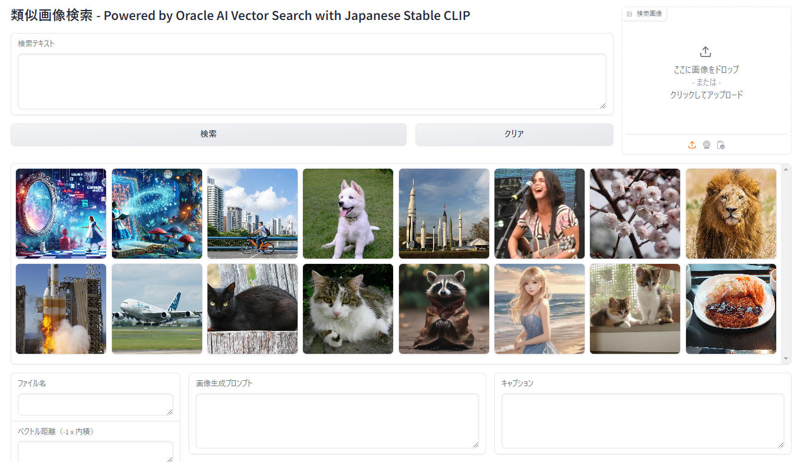
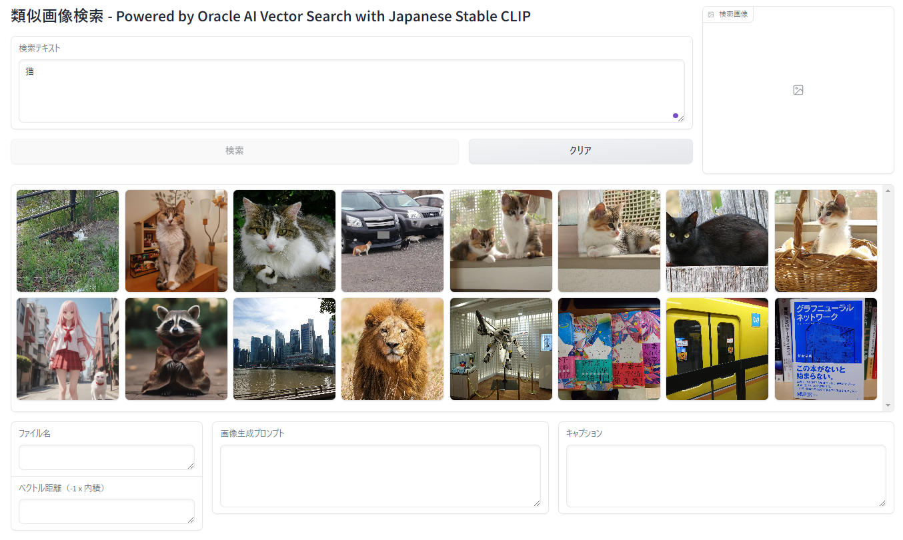
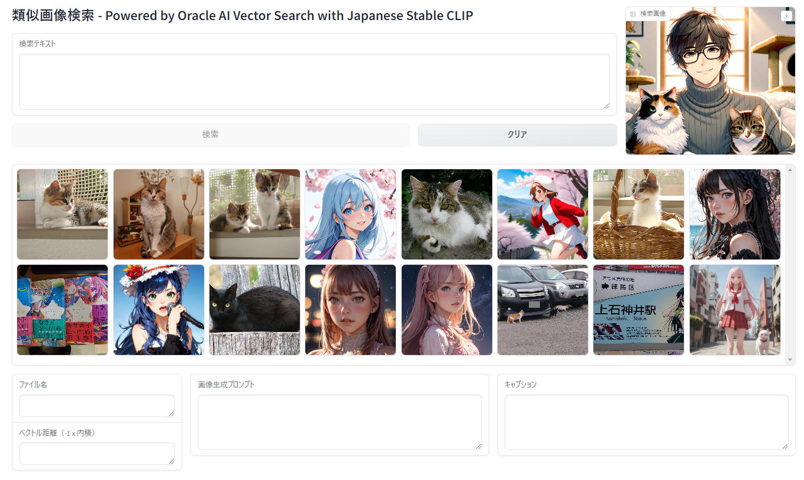
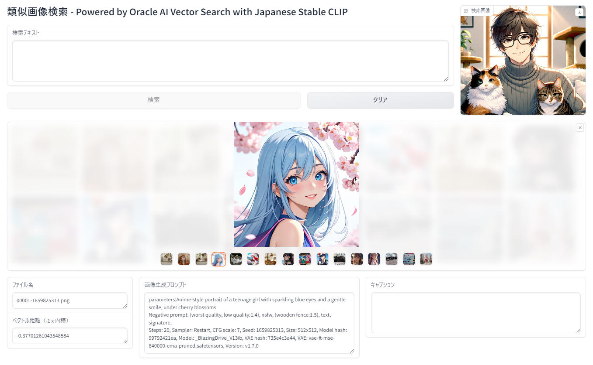

# Oracle Database 23ai AI Vector Search と Japanese Stable CLIP によるマルチモーダル画像検索

このプロジェクトは、Oracle Database 23ai AI Vector Search を使ってテキストから画像を検索したり、画像からその画像と類似した画像を検索するマルチモーダル・アプリケーションのサンプルです。
テキストと画像のマルチモーダルな検索のためのベクトル化には、Japanese Stable CLIP を使っています。日本語Stable CLIP は、GPUの無い環境でも動作する軽快なモデルです。


## 解説記事
[Qiita: Oracle AI Vector Search と Japanese Stable CLIP によるマルチモーダル画像検索](https://qiita.com/yuji-arakawa/items/9cd485debd5b0d18aca2)

## Japanese Stable CLIP とは
以下のブログ記事をご参照ください。
- [Japanese Stable CLIP による画像の分類（a.k.a. 画像によるテキストの検索）、そして画像検索に向けて](https://qiita.com/yuji-arakawa/items/042937eaf16fa00cf491)
- [最高性能の、日本語画像言語特徴抽出モデル「Japanese Stable CLIP」をリリースしました](https://ja.stability.ai/blog/japanese-stable-clip)

## 本アプリケーションの機能

- テキストによる類似画像検索
- 画像による類似画像検索
- 画像のメタデータ（生成プロンプト、キャプション）の表示
- PNGファイルのテキストチャンク情報の抽出と保存
- GPU の無い環境でも動作

## 前提条件

- Python 3.10以上
- Oracle Database 23ai インスタンス
- CPU上でも動作可能（GPUがあればなお良い）
- Hugging Face のアカウントがあること（[Hugging Face アカウント作成ページ](https://huggingface.co/join) で無料で登録することができます）
- Hugging Face の User Access Token を取得していること（[Hugging Face User Access Token 作成ページ](https://huggingface.co/settings/tokens) で無料で取得できます。"Type" は、"READ"）
- 動作は  OCI の VM.Standard3.Flex Compute Shape + Oracle Linux 8（CPUのみ） とローカルの Windows 11(CPUのみの場合とGPU利用の場合の両方) で確認しています。

## データベース環境のセットアップ
1. データベースのインストール

    日本オラクルの[チュートリアル](https://oracle-japan.github.io/ocitutorials/ai-vector-search/ai-vector106-23ai-langchain-rag/)の [1-1. Oracle Database 23ai Freeをインストールする](https://oracle-japan.github.io/ocitutorials/ai-vector-search/ai-vector106-23ai-langchain-rag/#1-1-oracle-database-23ai-free%E3%82%92%E3%82%A4%E3%83%B3%E3%82%B9%E3%83%88%E3%83%BC%E3%83%AB%E3%81%99%E3%82%8B) もしくは [1-2. Base Database Service環境でのセットアップ](https://oracle-japan.github.io/ocitutorials/ai-vector-search/ai-vector106-23ai-langchain-rag/#1-2-base-database-service%E7%92%B0%E5%A2%83%E3%81%A7%E3%81%AE%E3%82%BB%E3%83%83%E3%83%88%E3%82%A2%E3%83%83%E3%83%97) を実施してください。

    なお、この手順の中でユーザー（docuser） に様々な権限を付与していますが、これに VIEW を作成する権限も追加します。なお、ユーザー名は 1-1, 1-2 では vector となっていて、1-6 では docuser となっていますがお好みの任意の名前で作成してください。作成したユーザー名とパスワードは、.env ファイルに設定しますのでメモしておいてください。

    ユーザー名が docuser の場合は以下の SQL を sqlplus に sys ユーザーでログインした状態で実行します。
    ```
    sqlplus sys@localhost:1521/freepdb1 as sysdba
    ```
    ```
    GRANT CREATE VIEW TO docuser;
    ```

2. テーブルの作成

    sqlplus でデータベースへログインします（例です。ユーザー名、DSNは適宜書き換えてください）
    ```
    sqlplus docuser@localhost:1521/freepdb1
    ```

    以下のSQLで必要なテーブル群とインデックスを作成します

    ```
    -- IMAGES テーブル
    CREATE TABLE IMAGES (
        image_id NUMBER GENERATED ALWAYS AS IDENTITY PRIMARY KEY,
        image_data BLOB,
        file_name VARCHAR2(255),
        file_type VARCHAR2(50),
        upload_date TIMESTAMP DEFAULT CURRENT_TIMESTAMP,
        generation_prompt CLOB
    );

    -- EMBEDDING_MODELS テーブル
    CREATE TABLE EMBEDDING_MODELS (
        model_id NUMBER GENERATED ALWAYS AS IDENTITY PRIMARY KEY,
        model_name VARCHAR2(255),
        model_version VARCHAR2(50),
        is_current CHAR(1) CHECK (is_current IN ('Y', 'N')),
        vector_dimension NUMBER
    );

    -- IMAGE_EMBEDDINGS テーブル
    CREATE TABLE IMAGE_EMBEDDINGS (
        embedding_id NUMBER GENERATED ALWAYS AS IDENTITY PRIMARY KEY,
        image_id NUMBER,
        model_id NUMBER,
        embedding VECTOR,
        CONSTRAINT fk_image_embedding FOREIGN KEY (image_id) REFERENCES IMAGES(image_id),
        CONSTRAINT fk_model_embedding FOREIGN KEY (model_id) REFERENCES EMBEDDING_MODELS(model_id)
    );

    -- Vector indexの作成
    CREATE VECTOR INDEX image_embedding_idx ON IMAGE_EMBEDDINGS(embedding) ORGANIZATION NEIGHBOR PARTITIONS
    WITH DISTANCE DOT;

    -- IMAGE_DESCRIPTIONS テーブル（変更なし）
    CREATE TABLE IMAGE_DESCRIPTIONS (
        description_id NUMBER GENERATED ALWAYS AS IDENTITY PRIMARY KEY,
        image_id NUMBER,
        description CLOB,
        CONSTRAINT fk_image_description FOREIGN KEY (image_id) REFERENCES IMAGES(image_id)
    );

    -- 全文検索インデックスの作成
    CREATE INDEX idx_image_prompt ON IMAGES(generation_prompt) 
    INDEXTYPE IS CTXSYS.CONTEXT PARAMETERS ('SYNC (ON COMMIT)');

    CREATE INDEX idx_image_description ON IMAGE_DESCRIPTIONS(description) 
    INDEXTYPE IS CTXSYS.CONTEXT PARAMETERS ('SYNC (ON COMMIT)');

    -- 現在使用中のモデルを取得するビュー
    CREATE VIEW CURRENT_EMBEDDING_MODEL AS
    SELECT model_id, model_name, model_version, vector_dimension
    FROM EMBEDDING_MODELS
    WHERE is_current = 'Y';

    -- 現在のモデルによるエンベディングを取得するビュー
    CREATE VIEW CURRENT_IMAGE_EMBEDDINGS AS
    SELECT ie.embedding_id, ie.image_id, ie.embedding
    FROM IMAGE_EMBEDDINGS ie
    JOIN CURRENT_EMBEDDING_MODEL cem ON ie.model_id = cem.model_id;

    ```


## 本アプリのインストール

データベースインスタンスが稼働しているサーバー（OCIコンピュートインスタンスなど）のローカルにインストールする場合以外は、本アプリケーションがネットワーク越しに Oracle Database のリスナーへアクセスできるよう Firewall 等の設定を行ってください（補足予定）。

1. リポジトリをクローン：

    git がインストールされていない場合は、以下のコマンドでインストールします。
    ```
    sudo dnf install git -y
    ```

    リポジトリをクローンします。
    ```
    git clone https://github.com/kutsushitaneko/image-similarity-search.git
    cd image-similarity-search
    ```

2. Python のバージョン確認  

    次のコマンドで Python のバージョンを確認します。3.10 以上であることを確認してください。

    ```
    python --version
    ```
    3.10 よりも前のバージョンである場合は新しいバージョンをインストールします。以下は、Oracle Linux 8 に Python 3.11 をインストールする例です。

    ```
    sudo dnf update -y
    sudo dnf install -y oracle-epel-release-el8
    sudo dnf config-manager --set-enabled ol8_codeready_builder
    sudo dnf install -y python3.11
    python --version
    ```

2. （オプション）仮想環境の作成、アクティベート

    複数バージョンの Python がインストールされているサーバーで Python 3.11 の仮想環境を作成する例
    ```
    python3.11 -m venv .venv
    source .venv/bin/activate  # Windowsの場合: .venv\Scripts\activate
    ```

3. 必要なパッケージをインストールします：

    ```
    pip install --upgrade pip
    pip install -r requirements.txt
    ```

4. `.env`ファイルを作成し、以下の環境変数を設定します：

    your_username と your_password は、1-1 もしくは 1-2 で作成したデータベースにログインするためのユーザー名とパスワードです。
    your_database_dsn は、1-1 または 1-2 で設定したデータベースの接続情報です。

    ```
    DB_USER=your_username
    DB_PASSWORD=your_password
    DB_DSN=your_database_dsn
    ```

5. Hugging Face へログイン

    Japanese Stable CLIP のモデルを使用するために、Hugging Face へログインします。

    ```
    huggingface-cli login
    ```

    Hugging Face のバナーが表示されてトークン（User Access Token）の入力を促されます。

    ```
    $ huggingface-cli login

    _|    _|  _|    _|    _|_|_|    _|_|_|  _|_|_|  _|      _|    _|_|_|      _|_|_|_|    _|_|      _|_|_|  _|_|_|_|
    _|    _|  _|    _|  _|        _|          _|    _|_|    _|  _|            _|        _|    _|  _|        _|
    _|_|_|_|  _|    _|  _|  _|_|  _|  _|_|    _|    _|  _|  _|  _|  _|_|      _|_|_|    _|_|_|_|  _|        _|_|_|
    _|    _|  _|    _|  _|    _|  _|    _|    _|    _|    _|_|  _|    _|      _|        _|    _|  _|        _|
    _|    _|    _|_|      _|_|_|    _|_|_|  _|_|_|  _|      _|    _|_|_|      _|        _|    _|    _|_|_|  _|_|_|_|

    To login, `huggingface_hub` requires a token generated from https://huggingface.co/settings/tokens .
    Enter your token (input will not be visible):
    ```

    ここで Hugging Face のトークン（User Access Token）を入力します

    ```
    Add token as git credential? (Y/n)
    ```

    ここで、トークンを Git の認証情報として追加するかを選択します。どちらでも本アプリケーションの実行には影響ありません
    トークンが正しければ次のように表示されます

    ```
    Token is valid (permission: read).
    Your token has been saved to C:\Users\yujim\.cache\huggingface\token
    Login successful
    ```


## 使用方法

1. 画像の登録：

- ImageSearch.py と同じディレクトリに images ディレクトリを作成し、その中に画像ファイル群を保存します。
- register_images.py を実行して、データベースに画像ファイル群を登録します。
    ```
    python register_images.py
    ```

2. PNGファイルのテキストチャンク情報の抽出と保存：

    PNGファイルについては、そのテキストチャンク情報を抽出して、データベースに登録します。PNGファイルが AUTOMATIC1111 で生成したものであれば、その生成時のプロンプトも登録されます。JPEGファイルも画像検索対象にできますが、画像生成時のプロンプトやキャプションは登録されません。なお、プロンプトやキャプションの検索機能は未実装です。

    テキストチャンク情報の抽出とデータベースへの登録には、以下のコマンドを実行します。（images ディレクトリ配下にあるPNGファイルをスキャンしてテキストチャンク情報をデータベースへ登録します）
    ```
    python update_description_by_extracted_text_chunk.py
    ```

3. 検索システムの起動：

    次の Python スクリプトで アプリケーションを起動します。ローカルで実行している場合は Gradio の UI が手元のブラウザに表示されます。
    ```
    python ImageSearch.py
    ```

    OCI などのリモート環境などで自動的にブラウザが立ち上がらない場合は、ターミナルに表示されている `public URL` を手動でブラウザにコピーしてアクセスしてください。

    ```
    (.venv) ImageSearch $ python ImageSearch.py
    Running on local URL:  http://127.0.0.1:8899
    Running on public URL: https://xxxxxxxxxxxxxxxxxx.gradio.live
    ```

ブラウザで表示されるGradioインターフェースを使用して、テキストや画像による検索を行うことができます。

## 検索
- 左上の「検索テキスト」エリアに検索テキストを入力して、「検索」ボタンを押すと、そのテキストに関連する画像が表示されます。


    別の条件で検索するには「クリア」ボタンを押して検索テキストをクリアします（検索ボタンが有効になります）。検索条件を指定せずに「検索ボタン」をクリックするとアップロード日付が新しい順に16枚の画像が表示されます。
    なお、ベクトル検索による類似性検索ですので、フィルタリングとは異なり無関係な画像も類似度が低い画像として表示されます。テキストとの類似性が高い画像が左上に表示され、右、下へいくほど類似度が低い画像となります。画像は類似度が高い順に16枚表示されます。
- 右上の「検索画像」エリアに画像をアップロードして、「検索」ボタンを押すと、その画像に関連する画像が表示されます。

    こちらも同様にベクトル検索による類似性検索ですので、フィルタリングとは異なり無関係な画像も類似度が低い画像として表示されます。
    

- 検索結果は中央のギャラリーエリアに表示されます。特定の画像をクリックして選択すると画像が拡大表示され、ギャラリーの下部にその画像の詳細が表示されます。

    
    - ファイル名
    - ベクトル距離

        検索テキスト、もしくは、検索画像と、選択されている検索結果画像のベクトルの内積（の -1 倍）が表示されます。小さい程類似性が高くなります（画像を登録する際に特徴ベクトルを正規化しているため類似性検索では内積を使用しています）。
    - 画像生成プロンプト
    
        検索画像が生成された時のプロンプトが表示されます（現時点では、AUTOMATIC1111で生成された画像に対応）。
    - キャプション
    
        検索テキスト、もしくは、検索画像が生成された時のプロンプトが表示されます（現時点では、PNGのテキストチャンクをそのまま表示）。

## データベース構造

主要なテーブルは以下の通りです：

- IMAGES: 画像データとメタデータを保存
- EMBEDDING_MODELS: 埋め込みモデルの情報を管理
- IMAGE_EMBEDDINGS: 画像の埋め込みベクトルを保存
- IMAGE_DESCRIPTIONS: 画像の説明文を保存

詳細なテーブル構造は`create_all_tables.sql`ファイルを参照してください。

## ライセンス

- このプロジェクトはMITライセンスの下で公開されています。
- Japanese Stable CLIP のライセンスは Stability AI 社のライセンスをご確認ください。
- サンプル画像は、Wikimedia Commons でライセンスが "制限なし" となっているもの、私個人が撮影したもの、私が Stabile Diffusion や DALL-E 3 で生成したものをサンプルとして images ディレクトリに保存しています。動作確認にご利用ください。

## 謝辞

    このプロジェクトは以下のリソースを使用しています

- [Japanese Stable CLIP](https://huggingface.co/stabilityai/japanese-stable-clip-vit-l-16)

